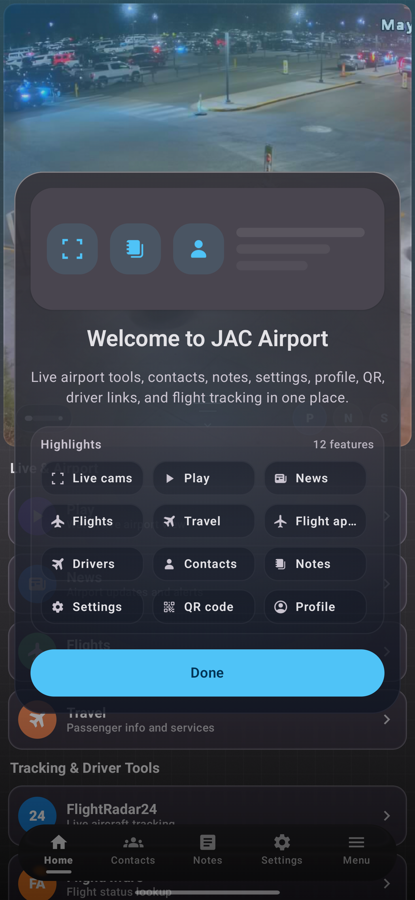
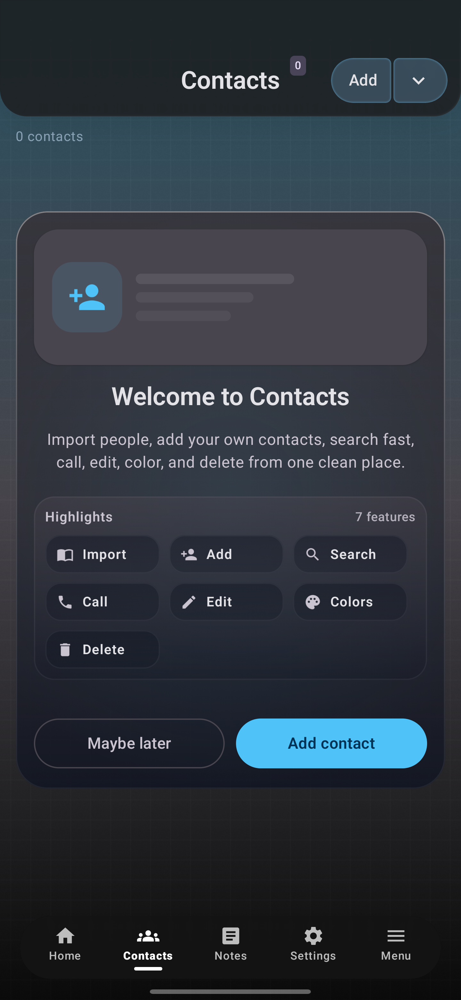
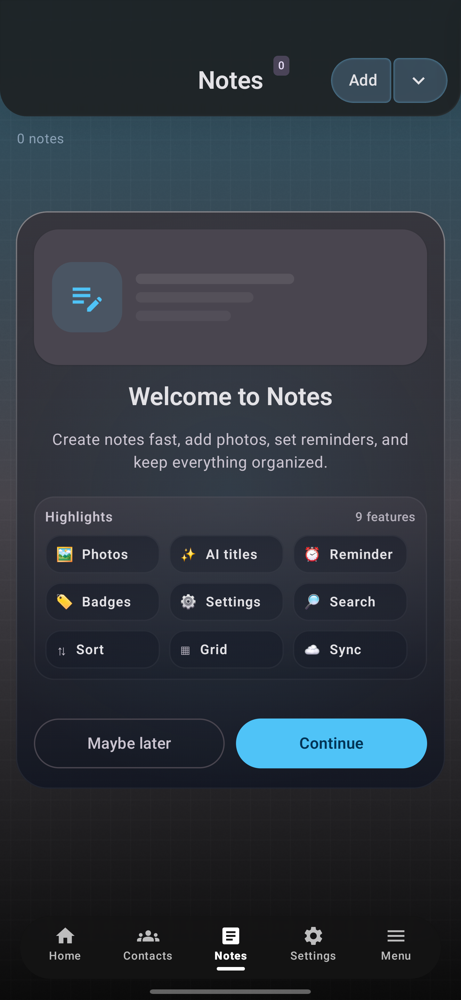
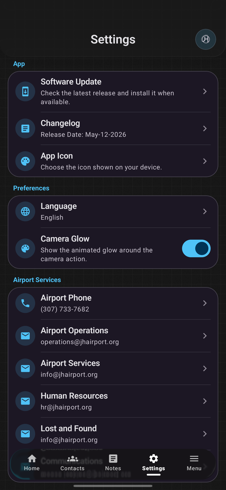
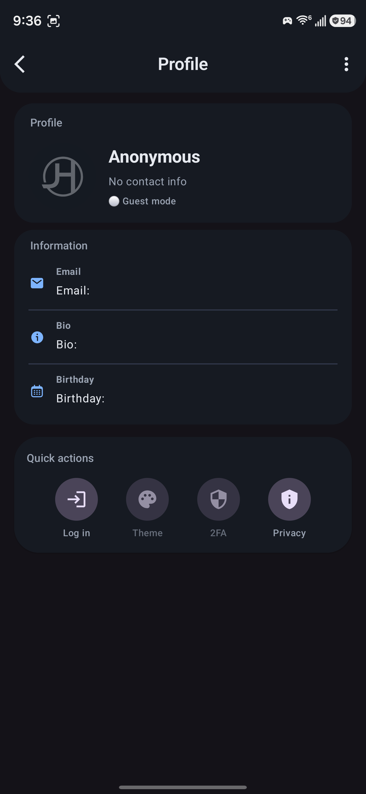
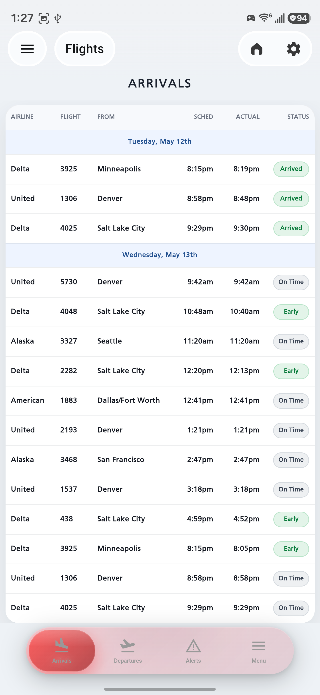
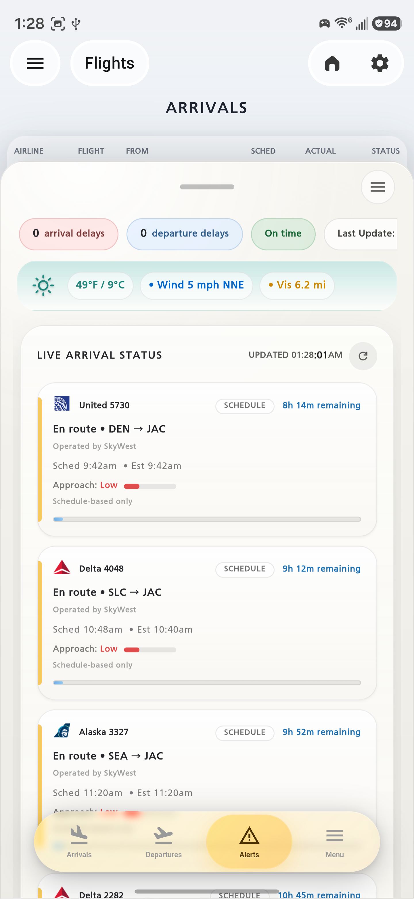
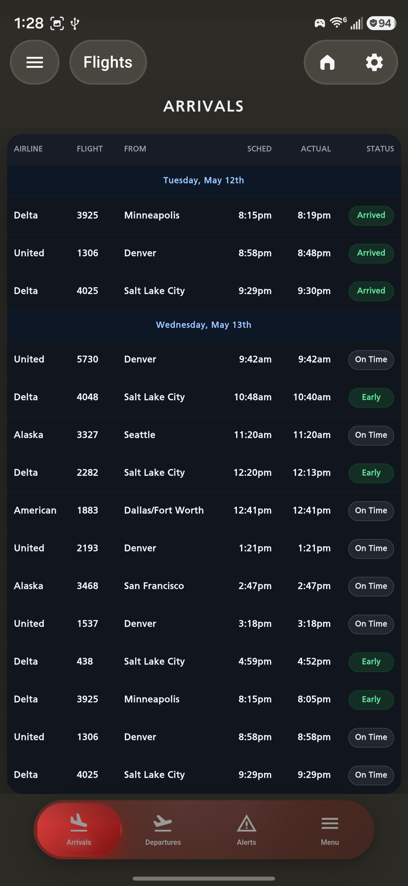
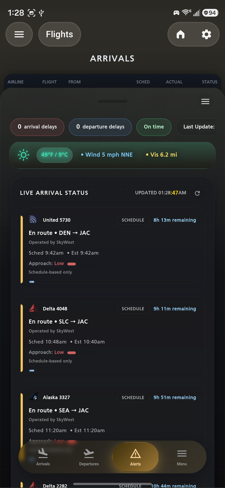

# JH AirTracker

JH AirTracker brings Jackson Hole airport tools, live flight information, notes, contacts, profile tools, QR, and travel shortcuts into one polished Android app.

The V248 release focuses on a smoother everyday experience: cleaner navigation, stronger account security, better notes and contacts onboarding, and a much richer flight screen with modern tables, live arrival status, weather, and inbound aircraft insight.

---

## Status

| Area | Status |
| --- | --- |
| App version | V248FLIGHTS |
| Build | 0.2.244 / versionCode 248 |
| Release date | May 12, 2026 |
| Android | Android 8.0+ |
| Main experience | Home, Contacts, Notes, Settings, Flights |

---

## What's New in V248

| Feature | What it means for users |
| --- | --- |
| Two-factor security | Add extra account protection with authenticator-app verification. |
| Modern flight tables | Flights are easier to scan with compact rows, clear date sections, and status pills like Arrived, Early, and On Time. |
| Flight intelligence | See live arrival cards, inbound aircraft status, weather, delay summaries, and approach confidence. |
| New bottom navigation | Move between Home, Contacts, Notes, Settings, and Menu with a cleaner Liquid Glass navigation bar. |
| Notes welcome flow | New users get a friendly notes intro with photos, reminders, search, sorting, grid view, sync, and settings highlights. |
| Contacts welcome flow | Contacts now introduces import, add, search, call, edit, color, and delete actions clearly. |
| Home dashboard | Airport tools, live cameras, flight tracking, travel links, QR, contacts, notes, settings, and profile are easier to discover. |
| Profile quick actions | Login, theme, 2FA, and privacy are grouped in a simple profile panel. |
| App icon choices | Choose from branded JH icon styles including seasonal and exclusive looks. |
| Feedback experience | Feedback now feels more interactive, with clearer sending status and a more modern presentation. |

---

## Flight Experience

The flight screen was rebuilt to feel more like a real airport companion:

| Flight feature | Included |
| --- | --- |
| Arrivals and departures | Yes |
| Modern compact table | Yes |
| Light and dark themes | Yes |
| Status pills | Arrived, Early, On Time, delays, cancellations |
| Live arrival status | Yes |
| Weather strip | Temperature, wind, visibility, warnings |
| Delay summary | Arrival delays, departure delays, on-time state |
| Inbound traffic | Aircraft cards with route, ETA, schedule state |
| Approach confidence | Low, medium, high approach signal where available |

---

## Preview

<table align="center" cellspacing="6" cellpadding="0">
  <tr>
    <td></td>
    <td></td>
    <td></td>
    <td></td>
  </tr>
  <tr>
    <td></td>
    <td></td>
    <td></td>
    <td></td>
  </tr>
  <tr>
    <td></td>
  </tr>
</table>

---

## Everyday Tools

| Section | Highlights |
| --- | --- |
| Home | Live cameras, airport news, flights, travel tools, driver links, QR, profile |
| Contacts | Import people, add contacts, search fast, call, edit, color, delete |
| Notes | Add notes fast, attach photos, set reminders, search, sort, sync |
| Settings | Searchable settings, app icon picker, update checks, language and privacy tools |
| Profile | Guest mode, login, theme, 2FA, privacy, account details |

---

## Update Notes

V248 continues the move to a cleaner pager-style app experience and adds stronger security with 2FA support. The flights screen is now much easier to read, with a modern table, status pills, live arrival cards, weather context, and inbound traffic details.

Notes and contacts now feel more welcoming for first-time users, while the home screen brings airport tools and travel shortcuts closer to the first tap.

---

## Credits & Thanks

Glass effects are powered by [AndroidLiquidGlass](https://github.com/Kyant0/AndroidLiquidGlass) by [@Kyant0](https://github.com/Kyant0).

  
  
  
  

  

